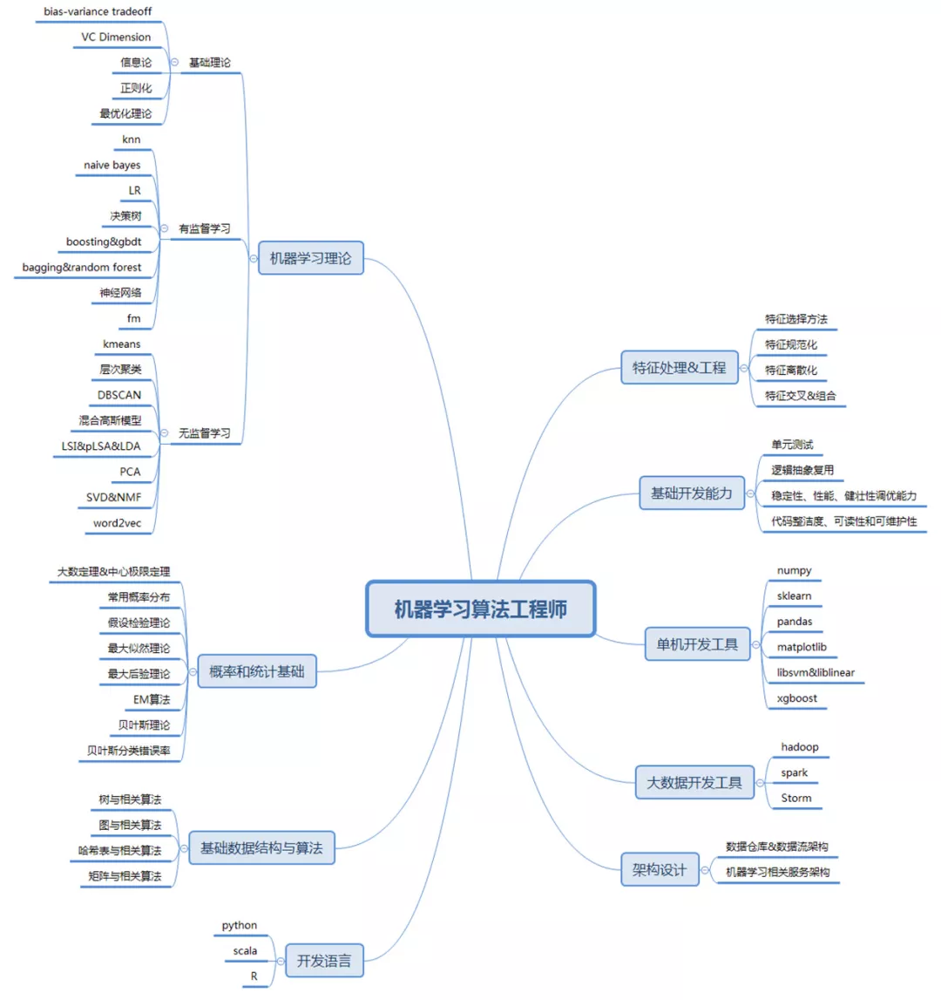

# ml-study

## 竞赛

- [datafountain](https://www.datafountain.cn/competitions)
- [tianchi](https://tianchi.aliyun.com/competition/gameList/activeList)
- [flyai](https://www.flyai.com/)

## 实践平台

- 数据仓库平台(基础层):采集/清洗/维度/建模/查询/用户画像/标签系统/自然语言
- 数据分析平台(业务线):定制报表/自助提数/样本特征/分析报告
- 机器学习平台(产品线):特征工程/训练/评估/部署/AB实验/微软Azure ML Studio/阿里PAI
- 深度学习平台(研究线):特征工程/GpuCluster/ParameterServer/ModelServer...
- 数据分析:网站分析、应用分析、游戏分析、广告分析、传播分析、心流算法、[指标说明](ailab/note/olap/readme.md)
- 大规模部署与管理:Docker,Kubenetes,Kubeflow,Horovod

## 技能体系

- 负载均衡:[nginx](http://nginx.org),[lvs](http://www.linuxvirtualserver.org),[haproxy](http://www.haproxy.org)
- 水平扩展:[dubbo](https://github.com/alibaba/dubbo)
- 邮件系统:[james](http://james.apache.org)
- 监控系统:[zabbix](https://www.zabbix.com),[Grafana](https://grafana.com)
- 统一授权:[Apache Directory](https://directory.apache.org),[OpenLDAP](http://www.openldap.org),[JumpServer](https://github.com/jumpserver/jumpserver)
- 数据存储:[mysql](https://www.mysql.com),[mongodb](https://www.mongodb.com),[cassandra](http://cassandra.apache.org),[H2](http://www.h2database.com),[SQLite](http://www.sqlite.org),Oracle,SqlServer,[FoundationDB](https://github.com/apple/foundationdb)
- 高速缓存:[redis](https://redis.io),[memcached](https://www.memcached.org),[twemproxy](https://github.com/twitter/twemproxy),[HBase](https://hbase.apache.org)
- 图数据库:[neo4j](https://neo4j.com),[InfiniteGraph](https://www.objectivity.com/products/infinitegraph/),[DEX](http://sparsity-technologies.com),[InfoGrid](http://infogrid.org/trac),[HyperGraphDB](http://hypergraphdb.org/),[Trinity](https://www.graphengine.io),[AllegroGraph](https://allegrograph.com),[OrientDB](https://orientdb.com)
- 爬虫采集:[Scrapy](https://scrapy.org)
- 中文分词:[Jcseg](https://github.com/lionsoul2014/jcseg)
- 日志采集:[flume](http://flume.apache.org),[logstash](https://www.elastic.co/cn/products/logstash)
- 消息队列:[kafka](http://kafka.apache.org),[ActiveMQ](http://activemq.apache.org),[confluent](https://www.confluent.io)
- 数据清洗:[Kettle](https://community.hds.com/docs/DOC-1009855),[DataX](https://github.com/alibaba/DataX),[Spark](http://spark.apache.org)
- 任务调度:[Oozie](http://oozie.apache.org/)
- 内存文件:[tachyon](https://www.alluxio.org)
- 倒排索引:[Lucene](https://lucene.apache.org/),[Elasticsearch](https://www.elastic.co/cn/products/elasticsearch),[Solr](http://lucene.apache.org/solr/)
- 数据仓库:[presto](https://github.com/prestodb/presto),[kylin](http://kylin.apache.org),[hive](http://hive.apache.org),[Greenplum](https://greenplum.org)
- 机器学习:[LightGBM](https://github.com/Microsoft/LightGBM),[numpy](http://www.numpy.org),[scikit-learn](http://scikit-learn.org),[sprkml](https://spark.apache.org),[spss](http://rj.baidu.com/soft/detail/14538.html),[matlab](https://cn.mathworks.com/products/matlab.html),[octave](http://www.gnu.org/software/octave/)
- 深度学习:[deeplearning4j](https://deeplearning4j.org/cn/),[Keras](https://keras.io/zh/),[TensorFlow-CN](https://tensorflow.google.cn),[TensorFlow-Code](https://github.com/tensorflow),[Caffe2](https://caffe2.ai),[PyTorch](http://pytorch.org/),[CNTK](https://developer.nvidia.com/cuda-downloads),[MXNet](https://github.com/apache/incubator-mxnet),[neon](https://ai.intel.com/neon),[ONNX](https://github.com/onnx/onnx),[ngraph](https://github.com/NervanaSystems/ngraph),[Chainer](https://chainer.org/),[PaddlePaddle](http://www.paddlepaddle.org/),[Darknet](https://pjreddie.com/darknet)
- 运营报表:[ECharts](http://echarts.baidu.com),[jetty](http://www.eclipse.org/jetty),[Bootstrap Metronic](https://keenthemes.com/metronic/),[ThinkingData](https://www.thinkingdata.cn)
- 资源隔离:[Docker](https://www.docker.com),[Kubernetes](https://kubernetes.io/)
- RPC框架:[Apache Thrift](http://thrift.apache.org)
- 用户画像:[Protégé](https://protege.stanford.edu),[Jena](http://jena.apache.org)
- 容灾同步:[Redis-XPipe](https://github.com/ctripcorp/x-pipe)
- 配置管理:[Apollo](https://github.com/ctripcorp/apollo)
- 前端框架:[Angular](https://angular.cn),[Vue](https://cn.vuejs.org),[React](https://reactjs.org),[jQuery](https://jquery.com),[Bootstrap](http://getbootstrap.com)
- 后端框架:[Spring](https://spring.io),[Struts](http://struts.apache.org),[Tomcat](http://tomcat.apache.org),[Wamp](http://www.wampserver.com/en),[Eureka](https://github.com/Netflix/eureka)
- 单点登录:[Apache Shiro](http://shiro.apache.org),[Spring Security](https://spring.io/projects/spring-security)
- 数据平台:[Apache Beam](https://beam.apache.org),[Cloudera Manager](https://www.cloudera.com)
- 实时分析:[Apache Flink](https://flink.apache.org),[Apache Storm](http://storm.apache.org),[ClickHouse](https://clickhouse.yandex),[Apache Druid](https://druid.apache.org)
- 数据挖掘:[IBM SPASS Modeler](https://www.ibm.com/cn-zh/products/spss-modeler),[IBM SPSS Statistics](https://www.ibm.com/cn-zh/products/spss-statistics),[RStudio](https://www.rstudio.com),[jupyter](https://jupyter.org),[zeppelin](https://zeppelin.apache.org),[hue](http://gethue.com),[Weka](https://www.cs.waikato.ac.nz/ml/weka/)

## 支撑体系

- 源码构建:[jenkins](https://jenkins.io/),[maven](https://maven.apache.org)
- 源码管理:[Gogs](https://gogs.io),[gitlab](https://gitlab.com),[visualsvn](https://www.visualsvn.com/server)
- 依赖关系:[mvn-repo](http://mvnrepository.com),[nexus](http://www.sonatype.org/nexus/go)
- 知识管理:[confluence](https://www.atlassian.com/software/confluence),[Wiki.js](https://github.com/Requarks/wiki)
- 测试用例:[TestLink](http://www.testlink.org)
- 缺陷管理:[jira](https://www.atlassian.com/software/jira)
- 用户管理:[crowd](https://www.atlassian.com/software/crowd)
- 操作系统:[CentOS](https://www.centos.org),[Ubuntu](https://www.ubuntu.com)
- 抓包工具:[Charles](https://www.charlesproxy.com/)
- 开发工具:[NoSQLManager](https://www.mongodbmanager.com)
- 接口管理:[yapi](https://github.com/YMFE/yapi),[ShowDoc](https://github.com/star7th/showdoc)

## 编程语言

- Java:https://docs.oracle.com/javase/specs
- Scala:http://www.scala-lang.org
- Python:https://www.python.org
- Julia:https://julialang.org
- GoLang:https://golang.org
- R:https://cran.r-project.org/doc/manuals/r-release/R-intro.html
- [C](https://en.wikipedia.org/wiki/ANSI_C),[Conan](https://conan.io),[GCC](https://gcc.gnu.org),[C++语言参考](https://docs.microsoft.com/zh-cn/cpp/cpp/cpp-language-reference?view=vs-2017),[Boost](http://stlchina.huhoo.net)

## 公开课

- Andrew Ng:http://open.163.com/special/opencourse/machinelearning.html
- 吴恩达机器学习:https://study.163.com/course/introduction.htm?courseId=1004570029
- Andrew Ng Home:http://www.andrewng.org
- EDX:https://www.edx.org
- Coursera:https://www.coursera.org
- TED:https://www.ted.com
- 网易:https://open.163.com
- Google edu:https://ai.google/education
- 更多推荐:https://www.zhihu.com/question/27952897
- [WIKI中文存档](https://dumps.wikimedia.org/zhwiki),[WIKI英文存档](https://dumps.wikimedia.org/enwiki)
- http://cuijiahua.com/blog/ml/
- https://morvanzhou.github.io/
- Kaggle(世界最大的数据科学家社区):https://www.kaggle.com
- 线性代数:https://www.youtube.com/channel/UCYO_jab_esuFRV4b17AJtAw/videos
- NVIDIA官方培训:https://www.nvidia.com/zh-cn/deep-learning-ai/education/
- AI应用案例:https://www.nvidia.com/zh-cn/deep-learning-ai/industries/ai-innovators/
- AI学习创作音乐:https://soundcloud.com/theaipodcast/ep-34
- AI算法工程师手册:http://www.huaxiaozhuan.com/

## 优秀论文库

- MIT:http://dspace.mit.edu/
- harvard:https://dash.harvard.edu/
- 科学网:http://www.sciencenet.cn/
- 康奈尔大学手稿论文:https://arxiv.org/

## 竞赛

- [全国青少年信息学奥林匹克竞赛](http://www.noi.cn)
- [奥林匹克数学竞赛](http://www.jsxbpt.com)
- [奥林匹克竞赛](https://baike.baidu.com/item/%E5%A5%A5%E6%9E%97%E5%8C%B9%E5%85%8B%E7%AB%9E%E8%B5%9B)

## 推荐书单

- [概率论与数理统计(第四版)](https://www.amazon.cn/dp/B00Y7UVZHQ)
- [线性代数(原书第9版)](https://www.amazon.cn/gp/product/B015H5F99Y)
- [数学之美(第二版)](https://www.amazon.cn/gp/product/B00P6OJ09C)
- [Python编程 从入门到实践](https://www.amazon.cn/gp/product/B01ION3VWI)
- [R语言实战(第2版)](https://www.amazon.cn/gp/product/B01FSXCBMS)
- [机器学习实战](https://www.amazon.cn/gp/product/B00D747PTK)
- [机器学习](https://www.amazon.cn/gp/product/B01ARKEV1G)
- [Go语言实战](https://www.amazon.cn/gp/product/B06XCCL7VV)
- [数据仓库工具箱(第3版):维度建模权威指南](https://www.amazon.cn/gp/product/B00RT6LB9W)
- [Scala编程实战](https://www.amazon.cn/gp/product/B01H6ZJFAW)
- [MongoDB权威指南(第2版)](https://www.amazon.cn/gp/product/B00HLX035Q)
- [Elasticsearch服务器开发(第2版)](https://www.amazon.cn/gp/product/B00U6Y5DGG)
- [Mahout实战](https://www.amazon.cn/gp/product/B00IWYN9KO)
- [Java编程思想(第4版)](https://www.amazon.cn/gp/product/B0011F7WU4)
- [HBase权威指南](https://www.amazon.cn/gp/product/B00F4AUYIO)
- [Hive编程指南](https://www.amazon.cn/gp/product/B00GXV27Q0)
- [Hadoop权威指南(第3版)(修订版)](https://www.amazon.cn/gp/product/B00OUFXPDA)
- [Spark大数据处理技术](https://www.amazon.cn/gp/product/B00QUG5C9C)

## 标准算法

- 推荐必读1:http://www.apachecn.org/map/179.html
- 推荐必读2:http://www.apachecn.org/map/145.html
- 机器学习:https://en.wikipedia.org/wiki/Portal:Machine_learning
- 梯度推进:https://en.wikipedia.org/wiki/Gradient_boosting
- PR算法:https://en.wikipedia.org/wiki/PageRank
- Word2vec:https://en.wikipedia.org/wiki/Word2vec
- tf–idf:https://en.wikipedia.org/wiki/Tf%E2%80%93idf
- k-means:https://en.wikipedia.org/wiki/K-means_clustering
- 随机森林:https://en.wikipedia.org/wiki/Random_forest
- 决策树:https://en.wikipedia.org/wiki/Decision_tree_learning
- 支持向量机:https://en.wikipedia.org/wiki/Support_vector_machine
- 贝叶斯分类:https://en.wikipedia.org/wiki/Naive_Bayes_classifier
- K最近邻:https://en.wikipedia.org/wiki/K-nearest_neighbors_algorithm
- AdaBoost:https://en.wikipedia.org/wiki/AdaBoost
- 余弦定理:https://en.wikipedia.org/wiki/Law_of_cosines
- 欧式距离:https://en.wikipedia.org/wiki/Euclidean_distance
- PageRank:https://en.wikipedia.org/wiki/PageRank
- 马尔科夫链:https://en.wikipedia.org/wiki/Markov_chain
- SVD奇异值分解:https://en.wikipedia.org/wiki/Singular-value_decomposition
- 布隆过滤器:https://en.wikipedia.org/wiki/Bloom_filter
- CRISP-DM:https://en.wikipedia.org/wiki/Cross_Industry_Standard_Process_for_Data_Mining

## 优质资源

- [AiLab](ailab/readme.md)
- [人工智能WIKI](https://zh.wikipedia.org/wiki/%E4%BA%BA%E5%B7%A5%E6%99%BA%E8%83%BD)
- [知识图谱](https://github.com/TeamStuQ/skill-map/blob/master/data/Preview-source-skillmap-PNG.md)
- [AIChallenger全球AI挑战赛](https://challenger.ai)
- [Google专利搜索](https://patents.google.com)
- [Google学术搜索](https://scholar.google.com)
- [顶级的深度学习框架比较](https://deeplearning4j.org/cn/compare-dl4j-torch7-pylearn.html)
- [AI芯片了解一下](http://china.xilinx.com)
- [Intel开发人员社区](https://software.intel.com/zh-cn)
- [刷刷题库?](https://leetcode-cn.com/problemset/all)
- [数学乐](https://www.shuxuele.com)
- [mathopolis](https://www.mathopolis.com)
- [mathsisfun](https://www.mathsisfun.com)
- [阿里巴巴矢量图库](https://www.iconfont.cn)

## 算法选择与知识体系




## 常用工具

### 开发工具

- IntelliJ IDEA
- JetBrains CLion
- JetBrains PyCharm
- Visual Studio Code
- Xmanager Enterprise 4
- Axure RP 8

### 数据分析

- Excel
- Matlab
- Octave:http://www.gnu.org/software/octave
- Power BI Desktop:https://powerbi.microsoft.com/zh-cn/desktop
- Tablau:https://www.tableau.com/zh-cn/products/desktop
- Qlik Sense:http://www.qlik.com/zh-cn/products
- Spss:http://www.spss.com.cn
- R:https://www.r-project.org
- RStudio:https://www.rstudio.com
- Python:https://www.python.org
- Anaconda:https://www.anaconda.com

### 数据库工具

- NoSQL Manager for MongoDB
- Navicat Premium 12
- JetBrains DataGrip
- Sqldeveloper
- SqlDbx

### 版本控制

- SourceTree
- TortoiseGit
- TortoiseSVN
- Git
- Gogs
- Gitlab

### 其他工具

- 7z
- Wps
- VLC media player
- VMware Workstation Pro
- Foxmail
- MarkdownPad 2
- Postman
- Notepad++
- 网易有道词典
- 亿图图示专家
- Google Chrome
- Chrome Extensions Markdown Preview Plus
- LaTex:http://www.ctex.org

## 游戏相关
- 场景设计:[Valve_Hammer_Editor](https://developer.valvesoftware.com/wiki/Valve_Hammer_Editor)


## 政策法规

- [国务院信息公开](http://www.gov.cn/zhengce/xxgkzl.htm)
- [《国家职业教育改革实施方案》.2019-02-13](http://www.gov.cn/zhengce/content/2019-02/13/content_5365341.htm)
- [《关于拟发布新职业的公示通告》.2019-01-25](http://www.cettic.gov.cn/zxzx/nzxdt/2019-01/25/content_464131.htm)
- [《中华人民共和国农村土地承包法》.2019-01-07](http://www.npc.gov.cn/npc/xinwen/2019-01/07/content_2070250.htm)
- [《新一代人工智能发展规划》.2017-07-20](http://www.gov.cn/zhengce/content/2017-07/20/content_5211996.htm)
- [《中国制造2025》.2015-05-19](http://www.gov.cn/zhengce/content/2015-05/19/content_9784.htm)

## 其他随记

### 其他知识

```text
OpenCL:并行编程，https://www.khronos.org/opencl
OpenGL:三维图形
OpenAL:计算机音频
OpenCV:视频图像
C++AMP:
```

### 推荐系统

```
0、推荐候选集
1、决策树二次筛选,决策树IF-THEN规则
2、点击率预估排序
3、推荐结果展示
4、推荐结果反馈
平台组成:
离线处理:偏好矩阵计算、推荐候选集、内容特征(物)，偏好特征(人)，环境特征(地)
混合系统:召回策略、倒排索引、混合策略、点击预估、置顶加权
实验平台:流量分桶、桶分组、实验时间、实验组、特殊条件、实验数据对比/置信度/评估
反馈系统:实验对比、特征拟合
```

### Google

0. 一切以用户为中心，其他一切纷至沓来. Focus on the user and all else will follow.
0. 把一件事做到极致. It's best to do one thing really, really well.
0. 快比慢好. Fast is better than slow.
0. 网络社会需要民主. Democracy on the web works.
0. 您不一定要在桌子前找答案. You don't need to be at your desk to need an answer.
0. 不做坏事也能赚钱. You can make money without doing evil.
0. 未知的信息总是存在的. There's always more information out there.
0. 对信息的需求无所不在. The need for information crosses all borders.
0. 不穿西装也可以严肃认真. You can be serious without a suit.
0. 仅有优秀是远远不够的. Great just isn't good enough.
0. 好产品满足人性七宗罪:饕餮、贪婪、懒惰、淫欲、傲慢、嫉妒、暴怒.

### git commit

```shell
git config --global user.name smartbooks
git config --global user.email smartbooks@qq.com
git remote set-url origin https://smartbooks@github.com/smartbooks/ml-study.git
git push origin [branch]

git tag
git tag -a v0.1 -m 'create message'
git push origin v0.1
git push origin --tags

#一些神奇的数字
nimble-sight-202908
bright-velocity-202909
quick-rarity-202909
cobalt-entropy-202909
trans-opus-202909
macro-duality-202909
amplified-ward-202909
infinite-pad-202909
pristine-cairn-202909
```
