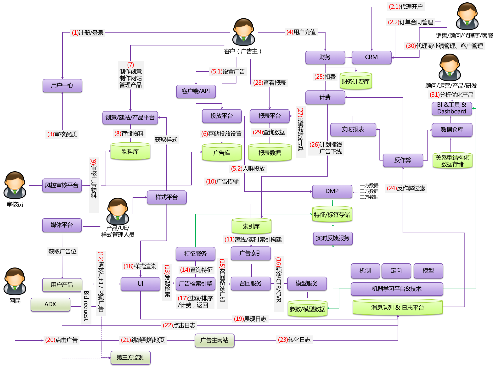

# 广告平台架构

## 架构图



## 流程阐述

```text
1、注册/登录
广告主登录系统，进行基本的鉴权，角色分配，账户管理。同时为营销参与者包括产品、运营、销售等提供登录、附身功能。

2、代理开户&订单合同管理
代理商可代理广告主开户，客户同样统一维护在用户中心；对于KA类广告主往往投放CPT、GD模式的合约广告，因此还需要订单管理、询量询价、合同确认等。

3、资质审核
风控平台审核广告主资质，进行基本的打标和风险控制。

4、用户充值
广告主通过财务平台充值，只有账户余额balance>0时，才具备广告投放准入资格。

5、设置广告
通过客户端、API，或者直接访问投放平台系统，可进行广告投放设置，包括设置预算、排期，添加推广计划、单元、关键词、定向、创意等。这个步骤是广告主表达其诉求的环节。另外图中5.2步骤可以通过DMP提供的平台进行“圈人”操作，现代的广告投放系统基本都可以进行人群定向，因此可以直接对目标受众进行广告投放。投放平台一般是业务系统，多使用服务化的方式构建。

6、存储投放设置
如果把投放平台看做一个复杂的状态机，其无状态，那么状态数据就在广告库中，一般使用结构化的OLTP存储引擎，例如分库分表MySQL、RDS，或者分布式数据库PolarDB、OB、TiDB等，保存了全局广告主的投放诉求。

7、制作创意、制作网站、管理产品
创意是传达推广意图的载体，因此往往会有专门的创意制作工具，以及创意制作的公司。对于中小广告主（SME），一些平台可以提供其基本的建站能力。对于大型广告主（KA），例如苏宁、携程，其可以通过产品库的方式进行创意制作，类似百度闪投，可节约大量创意制作成本，并且提供智能化的千人千面产品投放。现在越来越多的广告平台采用创意组件化的方式投放，基于广告主提供的素材，动态拼接组件，更好的进行个性化的投放，提高点击率。

8、存储物料
物料存储往往是一些非结构化的数据，例如图片、视频等，因此需要专门的存储引擎，例如OSS等，同时还需要同步到CDN等，用于C端在线展示。

8、审核广告物料
风控审核平台会对增量物料进行机审、人审，保证符合平台规范和制度，避免风险物料展示，同时可对创意进行分类打标。

10、广告传输
广告库需要传输到检索端的广告索引中，才可以在线生效。广告可全量导出，利用分布式计算引擎，例如Spark/MaxCompute等，生成基准文件；可实时增量下发，一般通过binlog机制，可使用canal、fountain、hiriver等开源组件，或者利用阿里云DTS下发到消息队列，可实现广告数据的多端解耦和广播下发订阅。

11-19属于检索端流程，检索端由于面向网民，面向流量产品，因此其广告请求往往QPS高，需要低延迟的返回广告结果，在极短的时间内（几百毫秒内，SLA每个平台不同）完成复杂的触发、定向、广告召回、拍卖机制计算、拼接渲染等环节，多数广告平台的检索端采用C++技术栈。

11、离线/实时索引构建广告索引
检索端订阅广告传输流，以及计划撞线、广告主状态的增量，将信息保存或者更新到索引库，其规模往往较大，通过索引服务暴露接口，例如可以通过类SQL方式，根据query查询符合条件的Ad。因此这里往往会做倒排索引，和传统搜索引擎不同的，这里的倒排是Ad，而不是网页，其查询主键可以是keyword，或者定向条件等等多个维度。

12、请求广告/展现广告
网民浏览用户产品，用户产品请求商业广告。访问UI的也可能是ADX，符合OpenRTB协议的bidrequest，这样广告平台可以接入其他ADX进行竞价，例如tanx。

13、发起检索
请求通过UI服务器，往往是7层负载或者经过封装的服务，向内网服务发起请求。

14、查询特征
请求session提取feature环节，可根据某些id或者id-mapping后唯一定位访问者，拿到query、访问上下文、用户基本信息（IP、IDFA、安卓ID、OAID等）、用户标签信息（兴趣、社会属性）、用户历史行为（搜索或者电商上的行为）等等，这些feature和用户数据供后续环节使用。特征、标签数据往往存储在分布式KV存储中。

15、召回备选广告
输入是请求特征，输出是符合条件的N条广告或者创意。召回通常需要访问广告索引，一般使用倒排索引，也就是feature->unit/creative，可以包含多个通道，所谓通道可以是各种触发方式，例如关键词触发，兴趣定向触发等等，召回的广告需要经过各种业务过滤，并且返回的Ad只包含基础信息，然后构造广告返回队列并截断处理，返回不超过阈值个Ad。这部分可以看做是粗排海选。从广义上来说，搜索广告的关键词匹配也可以发生在这个环节，通过短语匹配、宽泛匹配等来召回搜索广告。

16、预估CTR/CVR
对于粗排后的所有广告，需要进行相应的CXR预估后进行精排，CXR一般包括CTR点击率，或者CVR转化率，输入是<query,List<Ad>>输出是<query,List<pCXR>>，预估的调用发起往往是并行的计算密集型操作，依赖于modeling模块或者服务，一次查询涉及数百次的feature提取和查表，表往往是个大的hashmap，也就是策略端负责更新的模型文件，因为涉及各种特征或者组合数据，因此其文件规模往往巨大，几百G都有可能，需要全量加载到内存，保证访问时延。

17、过滤/排序/计费，返回
针对一些预算场景，需要做匀速消费（pacing）与超预算控制，针对媒体和用户会做频次控制，所以会过滤某些Ad。对于精选过的Ad需要进行排序，一般采用eCPM排序（rank），对于广告还需要查正排，例如查询标题、描述、url，拼接用于展示的数据，拼接加密后的点击串，落展现日志，通过GSP机制进行计费等。

18、样式渲染
广告检索引擎返回的若干创意，往往只是raw的结构化信息，需要结合前端的模板，进行渲染组装后再返回给前端。

19、展现日志
对于搜索广告，可以近似看做该条广告展现了，push到消息队列或者日志系统；对于推荐广告，还涉及填充料和曝光率的问题，因此实际用户看到的远小于返回的广告。

20、点击广告
用户如果感兴趣会点击广告。

21、跳转到落地页
创意展示并且触发动作，可以包括跳转到落地页，拨打电话等等。

23、转化日志
如果发生了真实的转化，转化日志push到消息队列或者日志系统。

24、反作弊过滤
对于展现、点击、转化数据，需要经过反作弊后再计费，反作弊的目的主要是保护广告主和平台利益，过滤无效的展现、点击，例如网站主刷量，竞争对手恶意点击以及不符合统计学规律的各种异常情况。

25、扣费
通过计费服务进行扣费，计费服务需要满足高性能、高吞吐、高可用、可扩展等非功能需求，实时处理展现、点击请求，在指定的推广层级上进行扣费，往往涉及流式计算范畴，例如可以使用Flink构建计费服务，计费需要保证不丢、不重，端到端的exactlyonce语义。扣费最终反馈到财务中心，扣用户的余额balance。

26、计划撞线/广告下线
对于预算撞线的推广计划，或者广告主余额不足的情况，需要及时下线广告，尽量避免超预算的损失，这部分信息需要实时的反馈到广告索引中，由于涉及平台收入敏感数据，因此可以和广告库分离，单独下发，通过隔离保证下发的实时性。

27、报表数据计算
这部分涉及离线数据处理，把收集上来的展点消数据，经过批量、实时的计算引擎，进行抽取、转换、拼接、过滤，最终输出给数仓warehouse，以及用于广告主查看的报表平台。对于数仓会面向广告领域建模，有各种事实表和维度表，供业务、算法、BI、dashboard查询使用。对于广告主，往往维度固定，面临高并发的海量查询，因此采用MOLAP的选型，例如PALO，Kylin，Druid，GoogleMesa、阿里ADB。

28、查看报表
广告主通过业务平台查询报表，例如最新7天所有推广计划的展点消数据。

29、查询数据
查询报表OLAPEngine。

30、代理商业绩管理、客户管理
CRM是业务平台中非常复杂的系统，面向销售、代理商、客服，典型功能包括线索管理、合同管理、开户，客户管理，业绩管理、返点等，通过运营的手段，为广告平台赋能。

31、分析优化产品
这部分的工作主要是数据分析相关，利用数据仓库技术，使用实时化方式，形成基础的事实和维度表，开源大多构建于HDFS上，使用ORC、Parquet、Carbondata等格式存储，使用HiveonMR、Spark做计算，ROLAP类使用Presto、Impala等查询。同时也会开发各种面向数据的服务，供BI、Dashboard、一些工具，以及算法工程师使用，用于观察系统大盘，实验对比，消费趋势等等，进一步做决策以及预警。

注：
1、本文主要阐述工程架构，对于策略端的算法，分为机制、触发（搜索广告）、定向（推荐广告）、模型等方向，限于笔者知识面，暂不展开。
2、样式平台是统一业务、检索、算法的标准化服务，业务端通过标准样式，供广告主编辑创意；检索端渲染会使用样式；算法可以基于样式做各种算法优选。
3、算法数据驱动业务流程，主要包括策略端通过机器学习进行建模后的模型数据，供modeling使用；通过实时的计算，可进行反作弊以及实时反馈服务到特征库；DMP通过引入多方的数据，帮助广告主更好的锁定目标人群，可以做用户画像、标签，用于在线检索理解session使用。
```